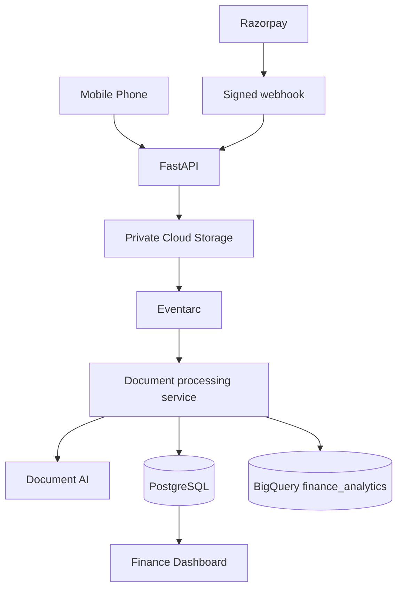

# Bills_Voucher Finance Management

A Python 3.12, FastAPI and PostgreSQL finance application for professional internal accounting. It uses PostgreSQL for operational accounting and is prepared for private GCS document storage, Document AI extraction, BigQuery analytics, and signed Razorpay webhooks.

## Implemented now (Phase 1–2 foundation)

- Secure session authentication with bcrypt password hashing and Admin/Accountant/Viewer roles.
- Responsive Bootstrap finance UI with dashboard, accounts, and transaction screens.
- Default INR / Asia-Kolkata finance setup and Indian-formatted currency values.
- SQLAlchemy 2.x PostgreSQL model layer, Alembic configuration, Docker Compose.
- Double-entry journal posting using `Decimal` and `NUMERIC(18,2)`: a journal entry cannot post unless debit equals credit.
- Default chart of accounts, account balances, and duplicate-reference protection.

## Architecture



## Local setup

```powershell
Copy-Item .env.example .env
docker compose up --build
```

Open http://localhost:8000 and sign in with `admin@local` / `ChangeMe123!`. Change this bootstrap password before deployment.

For non-Docker local development, use Python 3.12, create a virtual environment, run `pip install -e ".[test]"`, set `DATABASE_URL`, and run `uvicorn app.main:app --reload`.

## Tests

```powershell
pip install -e ".[test]"
pytest -q
```

## Required production environment variables

See [.env.example](.env.example). Production requires a strong `APP_SECRET_KEY`, Cloud SQL `DATABASE_URL`, private `GCS_BUCKET_NAME`, GCP configuration, Document AI processor, and Razorpay credentials/secrets. Do not commit `.env` files or service account keys.

## GitHub

The local GitHub CLI token currently needs re-authentication. Afterwards run:

```powershell
gh auth login -h github.com -w
git init
git add .
git commit -m "Initial project setup"
gh repo create Bills_Voucher --private --source=. --remote=origin
git push -u origin main
```

## Next phases

Document upload/review, private GCS integration, Document AI processing, BigQuery analytics, Razorpay webhook/backfill, reporting, audit logging, Cloud Run infrastructure, and their integration tests are the next implementation phases.

## Deployment

See [production deployment guide](docs/deployment.md). Cloud Run deployment uses private GCS, BigQuery `NUMERIC` financial fields, Secret Manager, Cloud Logging, and least-privilege service accounts.
