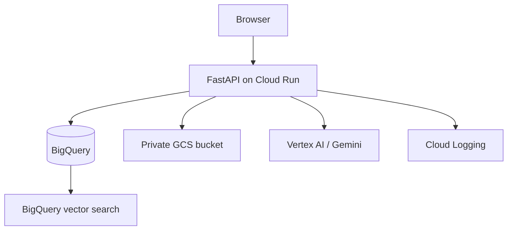

# Bills & Voucher — GST Compliance and Accounting Workspace

Bills & Voucher is a cloud-based application for Indian Chartered Accountants, CA firms, accountants, and finance teams. It combines accounting, bill processing, AI-assisted document extraction, GST validation, reconciliation foundations, and return tracking in one workspace.

The product goal is a **GST Compliance Operating System for CA firms**: manage many clients, find exceptions early, protect Input Tax Credit (ITC), prepare returns, obtain approvals, and retain a complete audit trail—without replacing the existing accounting application.

> **Compatibility rule:** this project adds modules alongside the existing accounting and document features. Existing pages, APIs, data, and accounting records must not be removed or made incompatible.

## What the application does


The application is not a replacement for the official GST portal and does not submit GST returns automatically. It prepares, validates, tracks, and documents the work that a CA team needs to complete before filing.

## Current modules

| Module | What it does | Why it is useful |
| --- | --- | --- |
| Dashboard | Shows financial overview, balances, recent entries and charts. | Understand a client's finances quickly. |
| Accounts | Maintains the chart of accounts and balances. | Provides the accounting structure behind reports and GST data. |
| Transactions | Records double-entry journal entries. | Keeps books balanced: total debits must equal total credits. |
| Expenses | Records business expenses. | Captures costs and potential input-tax information. |
| Bills & Vouchers | Uploads invoices, images and PDFs; stores originals and metadata. | Keeps source documents attached to the financial record. |
| Document Review | Shows AI-extracted invoice data for human verification and approval. | AI speeds up entry; human review preserves accuracy. |
| GST Compliance | Firm-level dashboard for client return status and deadlines. | Lets a CA see what needs attention today. |
| GST Health | Calculates a practical 0–100 compliance score for a client. | Highlights overdue returns, pending approvals and GST risk. |
| GST Returns | Creates and tracks GST return records and their workflow status. | Prevents missed due dates and makes ownership clear. |
| GSTR-1 Preparation | Summarises extracted sales/invoice data for GSTR-1 preparation. | Reduces manual preparation of outward-supply information. |
| GST Validation | Checks invoice data for common GST errors. | Finds data issues before reconciliation or return preparation. |
| GSTR-2B Reconciliation | Foundation for comparing purchase-register data with GSTR-2B. | Helps protect eligible ITC. |
| ITC Dashboard | Compares book ITC with GSTR-2B ITC totals. | Identifies potential and at-risk ITC. |
| Reports / Power BI | Presents finance and operational reports/charts. | Helps management and CA teams analyse the data. |
| Users | Controls application access by role. | Restricts sensitive actions to authorised users. |
| Audit Logs | Records important actions and changes. | Supports accountability and review. |

## Main user workflows

### 1. Upload and extract a bill or voucher

1. Open **Bills & Vouchers** and choose an image, PDF, or supported document.
2. The original file is stored privately in Google Cloud Storage (GCS).
3. A document record and file metadata are stored in BigQuery.
4. The AI extraction service reads the document.
5. Open **Document Review** to verify or correct supplier name, GSTIN, invoice number/date, taxable values, taxes, totals, HSN/SAC, and line items.
6. Approve or reject the reviewed document.

Supported upload types include JPEG, PNG, and PDF. Upload validation checks file type, size, and file signature. Duplicate documents are identified through file checksums.

### 2. Accounting

Use **Accounts** to define financial categories such as Bank, Cash, Sales, Purchases, Expenses, GST Payable, and Input GST. Use **Transactions** to post journal entries. Every journal entry is validated so that debit equals credit.

### 3. GST return tracking

Create return records for GSTR-1, GSTR-1A, GSTR-3B, GSTR-2B, IMS, CMP-08, GSTR-4, GSTR-9, and GSTR-9C. Each return records the period, due date, preparer, reviewer, tax liability, ITC, cash payable, ARN, and filing information.

The current workflow is:

```text
Import Data → Validate Data → Fix Errors → Reconcile → Prepare Return
→ CA Review → Client Approval → Ready to File → Filed
```

### 4. GST validation

The GST validation service checks common problems including GSTIN format/checksum, missing invoice details, duplicate invoice risk, supported GST rates, HSN/SAC format, tax calculations, interstate versus intrastate tax logic, and invoice total mismatches.

### 5. GSTR-2B and ITC

The reconciliation data model and matching helper are in place. Matching can treat variations such as `ABC/001/26` and `ABC00126` as a probable match, using GSTIN, normalised invoice number, date, and amount. The ITC dashboard compares purchase-book and GSTR-2B tax totals by IGST, CGST, SGST, and CESS.

## GST status colours

| Colour | Meaning |
| --- | --- |
| Green | Completed / Filed |
| Orange | Attention required, such as data pending or errors found |
| Red | Overdue or critical |
| Blue | Work in progress, such as preparing or reconciliation |
| Grey | Not started |

## Client access and roles

The top client selector allows an authorised user to switch clients without logging out. Current roles are **Admin**, **Accountant**, and **Viewer**. Viewers are prevented from sensitive document-processing actions; administrators manage users and configuration.

The roadmap adds CA-firm roles such as Partner, Manager, Article Assistant, Data Entry Operator, and Client with finer module-level permissions.

## Data, security, and infrastructure



- **FastAPI** provides server-rendered pages and API routes.
- **BigQuery** is the operational and analytics datastore for accounting, documents, audit data, GST records, and extracted fields.
- **Google Cloud Storage** stores original uploaded documents privately.
- **Vertex AI / Gemini** extracts structured information from invoices and vouchers.
- **BigQuery vector search** supports semantic document search when its index is configured.
- **Cloud Run** hosts the application, and **Cloud Logging** records operational failures for diagnosis.
- Passwords are stored as hashes; sessions are protected with a secret key and idle timeout; Cloud Run uses Google credentials rather than service-account key files in source control.

## Database migrations

Migrations are additive and must be applied in order:

1. `001_production_hardening.sql` — production baseline tables and safeguards.
2. `002_document_extraction_schema.sql` — document extraction and line-item support.
3. `003_gst_compliance_phase1.sql` — GST client profiles, return tracker, tasks, and preferences.
4. `004_gst_reconciliation_phase2.sql` — purchase invoices, GSTR-2B invoices, reconciliation matches, and validation issues.

Never delete or alter existing production data solely to introduce a new GST feature. Add nullable fields, new tables, indexes, and migration steps instead.

## Local development

### Prerequisites

- Python 3.12+
- A Google Cloud project with BigQuery, GCS, and Vertex AI access
- Application Default Credentials for local GCP access

### Run with Docker

```powershell
Copy-Item .env.example .env
docker compose up --build
```

Open `http://localhost:8000`.

### Run without Docker

```powershell
python -m venv .venv
.\.venv\Scripts\Activate.ps1
pip install -e ".[test]"
uvicorn app.main:app --reload
```

Set up Application Default Credentials before testing GCS, BigQuery, or AI extraction locally.

## Configuration

Copy `.env.example` to `.env` and configure at least:

```dotenv
APP_ENV=development
APP_SECRET_KEY=use-a-long-random-secret
GCP_PROJECT_ID=your-project-id
GCP_REGION=global
GCS_BUCKET_NAME=your-private-document-bucket
BIGQUERY_DATASET=finance_analytics
GEMINI_MODEL=gemini-2.5-flash
GEMINI_ENABLED=true
MAX_UPLOAD_MB=15
```

For production, use Secret Manager and Cloud Run environment configuration. Do not commit `.env` files, passwords, API keys, or service-account keys.

## Tests

```powershell
pip install -e ".[test]"
pytest -q
```

Run targeted tests after every module addition, especially document upload, extraction, accounting posting, existing APIs, and GST pages.

## Deployment

The application is designed for Google Cloud Run. See [docs/deployment.md](docs/deployment.md) for the production deployment guide. The deployed application URL is environment-specific; do not hard-code it in application logic.

## Delivery roadmap

### Completed foundations

- Existing accounting, documents, reporting, users, audit logs, and settings.
- GST Phase 1: firm dashboard, health score, return tracker, compliance calendar data foundation.
- GST Phase 2: validation foundation, GSTR-1 preparation baseline, reconciliation schema/smart matching helper, ITC dashboard baseline.

### Next: Phase 3

- GSTR-3B preparation and liability calculator
- RCM and IMS workspaces
- CA review checklist and maker-checker workflow
- Client approval history and approval screen

### Later phases

- Notices, tasks, supporting documents, advanced role permissions, audit/report exports
- Import preview for Excel, CSV, JSON, Tally, Zoho Books, Busy, Marg, ERP, and GST files
- Supplier compliance, ITC ageing, advanced analytics, alerts, global search, and AI CA assistant

## Contribution rules

Before adding a feature:

1. Inspect existing routes, tables, APIs, templates, and services.
2. Reuse an existing module where practical.
3. Add backward-compatible migrations only.
4. Keep the application’s existing UI language and navigation intact.
5. Add server and frontend validation, loading/success/error states, and audit logging when relevant.
6. Test existing accounting, document, and GST flows before deployment.

This approach keeps Bills & Voucher safe for existing users while steadily turning it into a practical GST compliance platform for CA firms.
