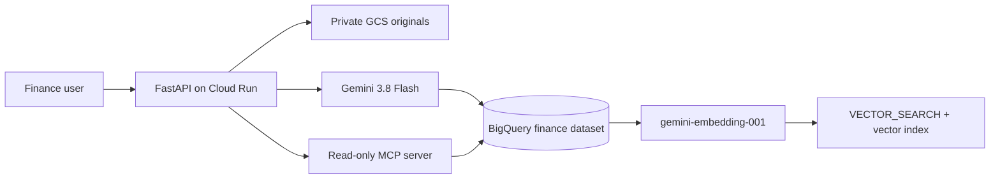

# Bills_Voucher Finance Management

A Python 3.12, FastAPI and BigQuery finance application for professional internal accounting. It uses BigQuery as the only operational and analytical data store, private GCS for source documents, Gemini for extraction, and BigQuery VECTOR_SEARCH for semantic retrieval.

## Implemented now (Phase 1–2 foundation)

- Secure session authentication with bcrypt password hashing and Admin/Accountant/Viewer roles.
- Responsive Bootstrap finance UI with dashboard, accounts, and transaction screens.
- Default INR / Asia-Kolkata finance setup and Indian-formatted currency values.
- BigQuery repository layer with provisioned finance, document, audit and embedding tables.
- Double-entry journal posting using `Decimal` and `NUMERIC(18,2)`: a journal entry cannot post unless debit equals credit.
- Default chart of accounts, account balances, and duplicate-reference protection.

## Architecture



## Local setup

```powershell
Copy-Item .env.example .env
docker compose up --build
```

Open http://localhost:8000 and sign in with the configured bootstrap identity and password from your secret-managed environment. Rotate it on first login.

For non-Docker local development, use Python 3.12, create a virtual environment, run `pip install -e ".[test]"`, configure Application Default Credentials and run `uvicorn app.main:app --reload`.

## Tests

```powershell
pip install -e ".[test]"
pytest -q
```

## Required production environment variables

See [.env.example](.env.example). Production requires a strong `APP_SECRET_KEY`, private `GCS_BUCKET_NAME`, GCP configuration, BigQuery dataset, and Vertex AI permissions. Do not commit `.env` files or service account keys.

## GitHub

The local GitHub CLI token currently needs re-authentication. Afterwards run:

```powershell
gh auth login -h github.com -w
git init
git add .
git commit -m "Initial project setup"
gh repo create Bills_Voucher --private --source=. --remote=origin
git push -u origin main
```

## Next phases

The production path is BigQuery-only: document upload/review, Gemini extraction, embeddings, VECTOR_SEARCH, analytics, audit logging and Cloud Run infrastructure.

## GST scanning and MCP

Bills and vouchers are uploaded to private GCS, then scanned with Gemini 3.8 Flash through `POST /documents/{document_id}/scan`. Vertex AI ADC is the default authentication path; set `GEMINI_API_KEY` only when using the Gemini API directly. Results are stored as reviewable GST fields and line items, and published to the partitioned BigQuery `document_extractions` table with an idempotent document row.

Install the application and MCP dependencies with `pip install -e ".[mcp]"`. Run the read-only MCP bridge with `python -m app.services.mcp_server`; it exposes document search and SELECT/WITH-only BigQuery queries. Deploy the infrastructure from `infra/` after setting `project_id` and `bucket_name`; do not put service-account keys in the repository.

## Deployment

See [production deployment guide](docs/deployment.md). Cloud Run deployment uses private GCS, BigQuery `NUMERIC` financial fields, Secret Manager, Cloud Logging, and least-privilege service accounts.

## BigQuery-only runtime

PostgreSQL and Cloud SQL are not used. Terraform creates the BigQuery dataset and tables, including `document_embeddings` with a repeated `FLOAT64` vector column. After Terraform, replace `PROJECT_ID` in `infra/vector_search.sql` and run it to create the IVF vector index. The application uses Vertex AI ADC on Cloud Run; local development uses Application Default Credentials.

Semantic search is available at `GET /documents/search?q=...` and through the MCP `search_documents` tool. Embeddings use `gemini-embedding-001`; the document and query task types are kept separate for retrieval quality.

## Next.js frontend

The frontend is in `frontend/` and uses the App Router. It proxies `/api/*` to FastAPI through the server-only `BACKEND_URL`, so browser requests do not need direct GCP credentials or CORS configuration.

```bash
cd frontend
cp .env.example .env.local
npm install
npm run dev
```

Set `BACKEND_URL=http://localhost:8000` locally. For Cloud Run, set it to the backend service URL. Build the container with `gcloud builds submit --config cloudbuild-frontend.yaml`.
