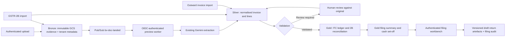

# Bills & Vouchers medallion architecture

Project: `aidirac-503309`. Region: `asia-south1`. Live dataset: `finance_analytics`; integration gates use `finance_analytics_staging` and tenant IDs prefixed `v5-integration-` with no user memberships.

## Storage map

Bucket: `gs://aidirac-503309-bills-voucher-documents`, uniform bucket-level access enabled, public-access prevention enforced, `ASIA-SOUTH1`.

| Layer | Object path | BigQuery tables |
|---|---|---|
| Bronze | `bronze/<client_id>/<yyyy>/<mm>/<doc_id>.<ext>` | `bronze_document` |
| Bronze 2B | `bronze/<client_id>/gstr2b/<period>/<import_id>.json` | `bronze_gstr2b_import` |
| Silver | `silver/<client_id>/<doc_id>.json` | `silver_invoice_header`, `silver_invoice_line`, `silver_gstr2b_invoice`, `silver_outward_invoice` |
| Gold | `gold/<client_id>/filings/<period>/gstr3b_<hash>.json` (or `gstr1_<hash>.json`) | `gold_itc_ledger`, `gold_gstr2b_match`, `gold_filing_summary` |
| Workflow | No separate source object | `gst_filing_status`, `gst_filing_audit` |

Migration `007_v5_medallion.sql` adds tables partitioned by event date and clustered by client and period. Existing tables/routes remain. New data does not silently backfill from legacy records or demonstration fixtures.

Bronze IDs derive from tenant and SHA-256 content. A repeated upload returns the existing ID. Bronze and gold objects use generation-zero writes; a retry can reuse an identical object but cannot replace different content. Derived silver can be reviewed and rewritten.

## Identity and reads

The signed session identifies `users`. Active memberships constrain the selected client; `client_user_role` supplies its current lowercase role. `gst_client_profile` supplies header identity and business settings. Red Taxi startup reads only `RED_TAXI_CLIENT_BOOTSTRAP`. The user's explicit deferral allows an incomplete profile with an empty GSTIN sentinel (the pre-existing column is REQUIRED). An absent GSTIN never becomes a fabricated registration number; validation and generation reject it.

New medallion SQL binds `client_id` and `period`. Workspace snapshots cache per `(dataset, client_id, period)` for five minutes; mutations evict that tenant/period. Workflow state and permissions are read fresh. Legacy identity-directory queries necessarily resolve identity before a tenant is selected; their user/email parameters are not substituted into SQL. Existing legacy child-record access retains parent document authorization.

Gold recomputation writes a complete run, then updates the summary's run pointer. Readers select ledger/matches by that run. An input hash prevents repeat recomputation; a content-derived numeric revision identifies `itc_<period>_<gstin-or-pending>_r<n>`, preventing concurrent different inputs from sharing a run ID.

## Eligibility and filing

All money enters through Decimal strings. Vehicle and related insurance/repair exceptions are business-nature aware; petrol/diesel are separate non-GST purchases. Rate-condition restrictions can still prohibit ITC. Missing tax evidence, unmatched 2B, section 16(4), R37 and common-credit R42/R43 decisions remain explicit. Missing common-credit turnover basis is deferred and blocks filing validation. Common-capital monthly calculations require the reviewer to maintain the relevant period input; an automatic multi-year fixed-asset register is not provided.

Set-off exhausts IGST first, does not cross-use CGST/SGST, and keeps cess separate. ECO 9(5) is cash-only. Filing transitions use a BigQuery transaction with an expected-state assertion and append-only audit. Source edits freeze after validation; locked periods return 409. Only tax administrators/admins can mark filed or lock.

Current generated JSON is explicitly a preparer draft (`bv-draft-2026-09`), not an assertion of GST portal compatibility. Configured schema-version mismatch fails. Verified GSTIN and current official portal schemas are prerequisites for upload-ready exports; this preview does not submit returns.

## Customer dashboard

Overview uses `GET /api/dashboard` and the Python service `app/services/gst/dashboard.py`. Financial values come only from `gold_filing_summary` and `gold_itc_ledger`, scoped to the selected tenant, period and current summary run. Profile and filing-status tables supply identity/workflow metadata only. It does not query Bronze/Silver, return document details, compute from unreviewed invoices, or substitute sample figures. Decimal totals are serialized as strings. Without a Gold summary the page explicitly shows no validated figures; it does not present missing data as zero balances. Uploads, pipeline counts and the review queue remain on Documents.

## Imports

`POST /api/gst/filing/import-2b?period=YYYY-MM` accepts a normalised `invoices` array with `supplier_gstin`, `invoice_no`, ISO `invoice_date`, `taxable_value`, `igst`, `cgst`, `sgst`, `cess` as decimal strings; it also accepts the portal's `data.docdata.b2b[].inv[].items[]` form. Import validates all rows before writing.

`POST /api/gst/filing/outward` accepts the same monetary fields with invoice number/date, recipient GSTIN, place of supply, SAC (default `9964`) and `eco_9_5`. Output tax reflects these records; the UI clearly identifies periods with no imported sales.

## Verification sources

- [CBIC clarification on motor-vehicle eligibility](https://cbic-gst.gov.in/pdf/circular-231.pdf).
- [CBIC input-tax-credit rules](https://cbic-gst.gov.in/input-tax-credit-rules.html).
- [GST portal advisory on section 9(5) and table 3.1.1](https://tutorial.gst.gov.in/downloads/news/gstr_3b_sec_9_5_advisory_19_07_22.pdf).
- [GST portal GSTR-1 preparation guide](https://tutorial.gst.gov.in/userguide/returns/Creation_of_Outward_Supplies_Return_in_GSTR-1.htm).
